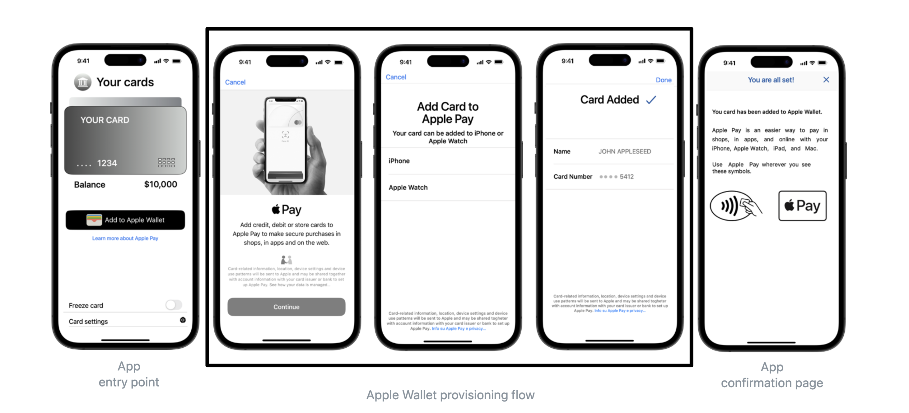
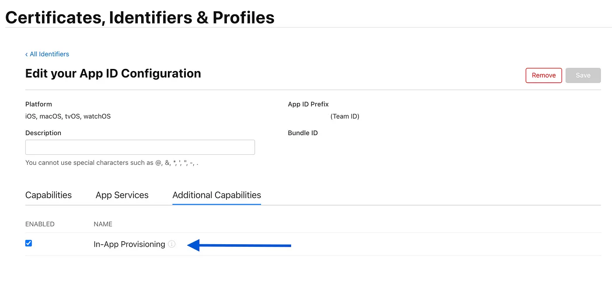
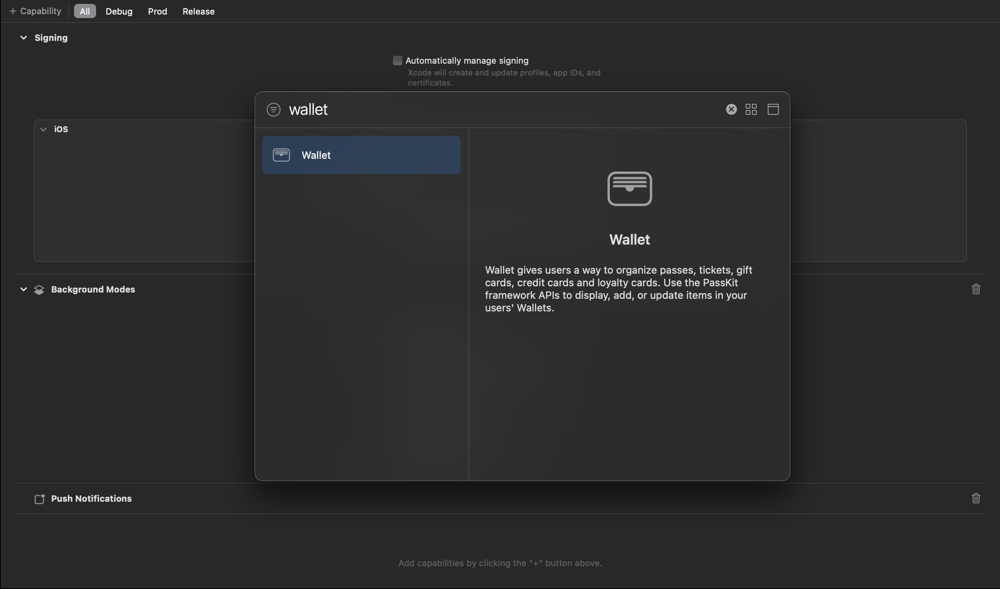
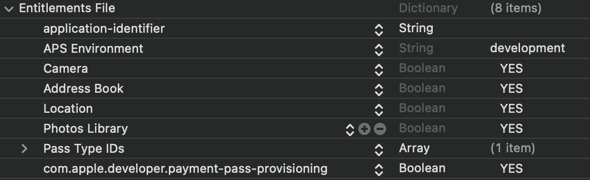
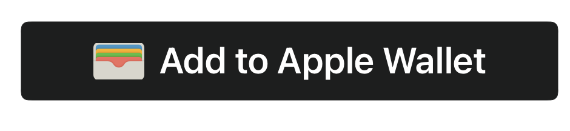
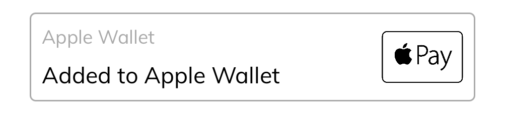

# MatchMove Apple Pay SDK (iOS)

## Version Information

| Date | Version | Changes |
| :--- | :--- | :--- |
| **July 2025** | **SDK v2.0.1** | • Added wallet extensions<br>• Added option to integrate SDK via Swift Package Manager<br>• Added common implementation issues<br>• Updated In-app provisioning - UI workflow, card object, formatting<br>• Updated functional testing section |
| **June 2023** | **SDK v1.0.0** | • In-app provisioning |

---

## Table of Contents
1. [Introduction](#introduction)
2. [Prerequisites](#prerequisites)
3. [In App Provisioning](#in-app-provisioning)
    - Overview
    - Getting Started
    - Configuring App Entitlements
    - Integrating SDK
    - Instantiating SDK
    - Checking Card State
    - Adding a Card to Apple Wallet
    - Additional Scenarios
4. [Wallet Extensions](#wallet-extensions)
    - Steps to Setup
    - Wallet Non UI Extension
    - Wallet UI Extension
5. [Functional Testing](#functional-testing)
    - Prerequisites for Apple Pay Testing 
    - Adding a Test Card to Apple Wallet 
    - Testing Apple Pay Transactions 
6. [Common Implementation Issues](#common-implementation-issues)

---

## Introduction

### Scope
This guide provides detailed information on implementation of in-app provisioning and wallet extensions for supporting Apple Pay within the customer facing iOS App of Partners including the technical aspects related to integrating the iOS SDK provided by MatchMove.

### 1. In-app provisioning
Apple Pay In-App Provisioning allows cardholders to add their cards directly to Apple Wallet from within the partner's iOS app, offering a secure, seamless experience by eliminating the need to manually enter card information. Cardholders find In-App Provisioning to be a seamless part of the unified iOS experience, enabling them to add cards to Apple Wallet alongside other in-app services.

### 2. Wallet Extensions
Wallet Extensions enable cardholders to add cards to Apple Wallet directly from within the Wallet app, offering the same seamless provisioning experience without requiring users to be in the Partner app. This enhances discoverability and convenience by allowing the entire process to be completed within Apple Wallet.

---

## Prerequisites

### 1. Meeting Apple Security Guidelines for the Partner App
To enable In-App Provisioning, the Partner App must comply with the following Apple security requirements:

* **A. Security Control Requirements:** Implementation of strong password policies, Minimum password length enforcement, and Maximum login attempts policy.
    * *Refer Apple document: Getting Started with Apple Pay In-App Provisioning: Verification and Security v4.pdf for complete details.*
* **B. Multifactor Authentication Requirement:** In-App Provisioning requires multifactor authentication using a one-time password (OTP) at least once before a card can be provisioned through the App.
* **C. Server Flag Handling Expectation:** There should be a server flag to enable or disable the Apple Pay functionality. It should be version-specific, allowing older versions to be disabled while enabling and testing newer versions in production.

### 2. Obtaining Entitlements from Apple
Before integrating the "Add to Apple Wallet" functionality in your app, program partners must request and obtain the required entitlements from Apple. Please contact your MatchMove Implementation Specialist for detailed guidance on the request process. Once approved and the Apple Pay Entitlements are granted, you can proceed to add In-App Provisioning to your iOS app.

### 3. Receiving Credentials from MatchMove
The App ID of the Partner's App must be whitelisted with MatchMove. Once the App ID and other required details are shared, MatchMove will provide the credentials associated with that App ID (`Program Code`, `Client ID`, `API Key` & `API Secret`). These credentials are necessary to initialize the SDK.

---

## In App Provisioning

### 1. Overview
The Apple Pay iOS SDK provides easy-to-use API for provisioning cards to Apple Wallet. The SDK offers various APIs for provisioning cards to Apple Wallet from start to end.
* Check provisioning status of the card on the device (e.g. iPhone) and paired device (e.g. Apple Watch).
* Get the current provisioning/card status in Apple Wallet on both device and paired device.
* APIs to add the card to the Apple Wallet.
* Objective-C support and Error Handling.

#### 1.1 SDK Compatibility
* 📱 **iOS:** iOS 14.0+
* 💻 **Xcode:** Xcode 15.0+
* 🧠 **Swift:** Swift 5.9+
* 🎟️ **Wallet Extension:** Supports integration with Apple Wallet extensions

### 2. Getting started

#### 2.1 UI Workflow

<p align="center">
  
</p>

#### 2.2 Tech Workflow
1. Integrate the Apple Pay iOS SDK.
2. Import and configure the SDK.
3. Get the SDK Instance.
4. Create a Mdes card object using MatchMove card data.
5. Get the current card status from SDK by passing the Mdes card object.
    * If the status is **unprovisioned**, show the "Add to Apple Wallet" button using `PKAddPassButton` given by Apple.
    * If the status is **activated**, show the "Added to Wallet" msg along with Apple Pay Mark. (Download it from here -- Marketing Guidelines - Apple Pay)
    * For all other card statuses, show message relevant message to the user.
6. When the user clicks on "Add to Apple Wallet" button, call the `addCardToWallet` API in the SDK.

### 3. Configuring App Entitlements
Partners should use the Apple Developer website to select and configure the entitlement profile under Certificates, Identifiers & Profiles.

<p align="center">
  
</p>


**Enabling Wallet Capability:**
1. Open your app's project file in Xcode. Then select your app's target under the target list.
2. Next select the **Signing & Capabilities** tab.
3. Click on the **+ Capability** above the code signing section.
4. In the capability pop up search for **Wallet**, Double click on the wallet to add the capability to the project.

<p align="center">
  
</p>

**Entitlements File:**
Open in Xcode the projects entitlement file and add the below entitlement key value pair:
* **Key:** `com.apple.developer.payment-pass-provisioning`
* **Type:** Boolean
* **Value:** `YES`

<p align="center">
  
</p>

### 4. Integrating SDK

#### Option A. Integrating via Swift Package Manager
* **SPM URL:** https://github.com/matchmove/mdes-sdk-ios
* **Tag:** `2.0.1`

#### Option B. Manual Integration
1. Move the `MdesSdk.framework` artefact into your project.
2. Add the `MdesSdk.framework` located within your project to the **Embedded Binaries** section in the **General** tab of your iOS app target.
3. Open your app's project file in Xcode. Then select your app's target under the target list.
4. Next, Select the **Build Phases** tab and under the **Embed Frameworks** step add a new **Run Script Phase**. Name it "Mdes Framework Archive". (This script will remove simulator architectures while archiving).
5. In the text area add the following code:

```bash
if [[ "$ACTION" != "install" ]]; then
    exit 0;
fi
FRAMEWORK_DIR="${CONFIGURATION_BUILD_DIR}/${FRAMEWORKS_FOLDER_PATH}"
MDES_FRAMEWORK="${FRAMEWORK_DIR}/Mdes.framework"
cd "${MDES_FRAMEWORK}"
lipo -remove i386 Mdes -o Mdes
lipo -remove x86_64 Mdes -o Mdes
```

Add the following import statement `import MdesSdk` to use the SDK.

### 5. Instantiating SDK

**Note:** As Apple Wallet is not available in all countries, ensure that the physical device region is set to a country where Apple Wallet is available e.g. Singapore. To change the device region go to Settings → General → Language and Region → Region and then select a region (e.g Singapore) where Apple Wallet is available.

#### 5.1 Swift

```swift
/*
* programCode: Unique code of the program(Provided by matchMove).
* clientId : Unique id of the client(Provided by matchMove).
* apiKey: Key for api authentication (Provided by matchMove).
* apiSecret : Secret for api authentication (Provided by matchMove).
* bundleId : Bundle id of the app. 
*/

let mdesConfig = MdesConfig(programCode: "programCode",
                            clientId: "clientId",
                            apiKey: "apiKey",
                            apiSecret: "apiSecret",
                            bundleId: "bundleId")
MdesSdk.configure(config: mdesConfig)
do {
    // Should be stored in an instance variable
    self.mdesSdk = try MdesSdk.mdesSdk()
} catch let error as MdesSdkError {
    switch error {
    case .sdkNotSetUp:
        break
    case .appleWalletUnavailable(let errorMsg):
        break
    }
    self.mdesSdk = nil
} catch {
    self.mdesSdk = nil
}
```

**NOTES:**
- `MdesSdkError.sdkNotSetUp`: Call `MdesSdk.configure(_:)` static function to configure the sdk.
- `MdesSdkError.appleWalletUnavailable`: Apple Wallet is not available in your region. The associated string returns an error message for debugging.

#### 5.2 Objective-C

```objc
MdesConfig* config = [[MdesConfig alloc] initWithProgramCode: @"programCode"
                                                    clientId: @"clientId"
                                                      apiKey: @"apiKey"
                                                   apiSecret: @"apiSecret"
                                                    bundleId: @"bundleId"];
[MdesSdk configureWithConfig: config];
NSError* error;
// Should be stored in an instance variable
self.mdesSdk = [MdesSdk objcMdesSdkAndReturnError: &error];
if(error != nil) {
    ObjcMdesSdkError mdesError = (ObjcMdesSdkError)error.code;
    switch (mdesError) {
        case ObjcMdesSdkErrorSdkNotSetUp:
            break;
        case ObjcMdesSdkErrorAppleWalletUnavailable:
            break;
        default:
            break;
    }
    NSLog(@"%@", error.debugDescription);
    return;
}
```

### 6. Checking Card State

According to Apple's Add to Wallet functionality guideline, the Add to Wallet button should only be shown when at least one device has not been provisioned. The `getCardStatus(card : MdesCard)` returns the current state of the card provisioning.

<p align="center">
  
</p>

**Note:** The app should update the visibility of the Apple Wallet button when the device resumes from background to foreground. This should be done to reflect in the app any changes to the card state (e.g card activation, suspension, deactivation etc) occurring in the Apple Wallet App.

#### 6.1 Add to Apple Wallet Button UI Example

```swift
func addAppleWalletButton(to parentView: UIView, target: Any?, action: Selector) -> PKAddPassButton {
    let addToWalletButton = PKAddPassButton(addPassButtonStyle: .black)
    addToWalletButton.translatesAutoresizingMaskIntoConstraints = false
    addToWalletButton.addTarget(target, action: action, for: .touchUpInside)
    parentView.addSubview(addToWalletButton)
    return addToWalletButton
}
```

Based on the Card state from `getCardStatus` method, the button will be hidden or shown.

#### 6.2 Getting Card State

The params required to initialise the `MdesCard` Object can be fetched from Cards API.

**Swift:**

```swift
let mdesCard = MdesCard(cardId: "cardId",
                        cardLastFourDigit: "cardLastFourDigit",
                        cardHolderName: "cardHolderName",
                        cardProviderName: "cardProviderName", 
                        cardLocalizedDescription: "cardLocalizedDescription",
                        cardImageURL: URL?)
let cardState: MdesCardState? = mdesSdk.getCardStatus(card: mdesCard)
```

**Objective-C:**

```objc
MdesCard* card = [[MdesCard alloc] initWithCardId: @"cardId"
                                cardLastFourDigit: @"cardLastFourDigit"
                                   cardHolderName: @"cardHolderName"
                                 cardProviderName: @"cardProviderName"
                          cardLocalizedDescription: @"cardLocalizedDescription"
                                     cardImageURL: URL];
MdesCardState cardState = [self.mdesSdk getCardStatus: card];
```

#### 6.3 Cards API Details

 
* **Cards API URL:** https://developer.matchmove.com/docs/optimus-prime/op-api/operations/get-a-user-wallet-card


- **cardId:** Unique id of the card from the matchmove cards api. (response field - "id")
- **cardLastFourDigit:** Last four digits of the card number to Add to Apple Wallet. (response field - retrieved from "number")
- **cardHolderName:** The card holder name available from the matchmove cards api. (response field - "id")
- **cardProviderName:** Name of the card provider (MasterCard, Visa etc). Currently it is Mastercard for SG region.
- **cardLocalizedDescription:** response field - "type.description"
- **cardImageURL:** response field - "image.medium"

#### 6.4 Card States Description

```swift
@objc public enum MdesCardState: Int {
    // Card has been added to apple wallet and the card hasn't been activated.
    case requiresActivation = 0 // Objc: MdesCardStateRequiresActivation
    // Card has been added to apple wallet, card activation has been initialized.
    case activating = 1 // Objc: MdesCardStateActivating
    // Card has been added to apple wallet and activated.
    case activated = 2 // Objc: MdesCardStateActivated
    // Card has been added to apple wallet and the card is suspended.
    case suspended = 3 // Objc: MdesCardStateSuspended
    // Card has been added to apple wallet and the card is deactivated.
    case deactivated = 4 // Objc: MdesCardStateDeactivated
    // Card hasn't been provisioned to apple wallet.
    case unprovisioned = -1 // Objc: MdesCardStateUnprovisioned
    // Applicable only for remote paired devices(Apple Watch)
    // Card state is not available for the device as there are no remote device paired to the main device.
    case unavailable = -999 // Objc: MdesCardStateUnavailable
}
```

### 7. Adding a Card to Apple Wallet

The card state should be **unprovisioned** for the SDK to add the card to Apple Wallet. When a card state is not **unprovisioned** or **unavailable** the card has been added to Apple Wallet. Once the card has been successfully added to Apple Wallet to all paired devices, then the "Add to Apple Wallet" button should change.

<p align="center">
  
</p>


#### 7.1 Swift

```swift
/*
* userId: Unique id of the user from the matchmove user api.
* mdesCard: An MdesCard object.
* completion: Completion block that return a result object `Result<String, MdesProvisioningError>`
*/

if let controller = mdesSdk?.addCardToWallet(userId: "userId",
                                             card: mdesCard,
                                             completion: handler(result:)) {
    self.present(controller, animated: true)
}

func handler(result: Result<String, MdesProvisioningError>) {
    switch result {
    case .success(let msg):
        break
    case .failure(let error):
        switch error {
        case .appleWalletError(let errorMsg):
            break
        case .serverCallFailed(let errorMsg):
            break
        case .provisioningError(let errorMsg):
            break
        case .userCancelled:
            break
        }
    }
}
```

**NOTES:**
- **success:** Card has been added to Apple Wallet. Hide the **Add to Wallet button** when card has been provisioned on all the devices.
- **MdesProvisioningError.appleWalletError:** Unable to initiate provisioning with the given card details. The associated object contains error message.
- **MdesProvisioningError.serverCallFailed:** Card tokenization api call to the MatchMove server failed. The associated object contains details on the api failure.
- **MdesProvisioningError.provisioningError:** Unable to provision card. The associated object contains error message from apple on provisioning failure.
- **MdesProvisioningError.userCancelled:** User cancelled card provisioning.Show or Hide the Add to Wallet button by checking if the card has been provisioned on all the devices.

#### 7.2 Objective-C

```objc
UIViewController * controller = [self.mdesSdk addCardToWalletWithUserId: @"userId"
                                                                   card: card
                                                                success:^(NSString * msg) {
    NSLog(@"%@", msg);
} failure:^(NSError * error) {
    ObjcMdesProvisioningError mdesError = (ObjcMdesProvisioningError)error.code;
    NSString* msg = error.userInfo[@"message"];
    switch (mdesError) {
        case ObjcMdesProvisioningErrorAppleWalletError: break;
        case ObjcMdesProvisioningErrorUserCancelled: break;
        case ObjcMdesProvisioningErrorServerCallFailed: break;
        case ObjcMdesProvisioningErrorProvisioningError: break;
        default: break;
    }
    if (msg != nil) {
        NSLog(@"%@", error.debugDescription);
    }
}];
if (controller != nil) {
    [self presentViewController:controller animated:YES completion:nil];
}
```

**NOTES:**
- **success:** Card has been added to Apple Wallet. The success block param contains the success message. Hide the **Add to Wallet** button when card has been provisioned on all the devices.
- **MdesProvisioningError.appleWalletError:** Unable to initiate provisioning with the given card details. The returned NSError userinfo contains the error message.
- **MdesProvisioningError.serverCallFailed:** Card tokenization api call to the MatchMove server failed. The returned NSError userinfo contains the details on the api failure.
- **MdesProvisioningError.provisioningError:** Unable to provision card. The returned NSError userinfo contains the error message from apple on provisioning failure.
- **MdesProvisioningError.userCancelled:** User cancelled card provisioning.
Show or Hide the **Add to Wallet** button by checking if the card has been provisioned on all the devices.


#### 7.3 Error codes and messages from MdesProvisioningError / ObjcMdesProvisioningError:**


**7.3.1 MdesProvisioningError.appleWalletError / ObjcMdesProvisioningErrorAppleWalletError:** The following error messages are returned as part of error.
"Wallet View Controller was not initialized! ⚠️" .


**7.3.2 MdesProvisioningError.serverCallFailed / ObjcMdesProvisioningErrorServerCallFailed:** 

Bad Request - **http 400** - Invalid user | Invalid card | Missing user id on header | Invalid consumer | card detail not found for: %s | Invalid value for field %s | network not supported | unsupported card type | expiry date is in invalid format. Must be in YYYY-MM | cannot proceed verification due to missing or invalid configuration details

Unauthorized - **http 401** -  mastercard_authorization_failed | Authorization failed

Internal Server Error - **http 500** - Bad Request - internal_server_error | Error occured while creating TAV | internal_server_error | Symmetric key generation failed |


**7.3.3 MdesProvisioningError.provisioningError /  ObjcMdesProvisioningErrorProvisioningError:** 

unsupported - Apple pay is not available in the device region, go to Settings → General → Language & Region and change the region to Apple Wallet supported region (e.g Singapore).

systemCancelled - Apple Wallet has canceled card provisioning.


### 8. Additional Scenarios

#### 8.1 Handling the “Card not verified” scenario

If the user does not complete the card verification step during provisioning (e.g., exits midway or fails the OTP step), correct status of the card should be displayed to the user. 

Display an appropriate message indicating the card is not yet activated. Example: “Card not activated. Go to Apple Wallet to complete verification”

In such cases, the verification process cannot be re-initiated from within the app. The user must go to the Apple Wallet app on their device to complete the verification and finish provisioning the card. 


#### 8.2 Jailbroken Devices

For Jailbroken devices the app should display an error and prevent the users from using the app's services. This is required for deploying the app in Apple Appstore.

Refer to SDK package - UIDeviceExtension.swift file to handle the error on the App. 

**Note:**: All assets required for the integration like Apple Pay Mark will be included in the SDK. Please reach out to your Implementation specialist for any assistance. 


**References**:

**PKAddPassButton** -  https://developer.apple.com/documentation/passkit/pkaddpassbutton

---

## Wallet Extensions

Wallet Extensions allow users to add cards directly from the Wallet app without opening the partner app.

### Steps to Setup

1. **Create Wallet Extension Targets**
   - Add Wallet Non-UI Extension target
   - Add Wallet UI Extension target (optional)

2. **Configure App Groups**
   - Create App Group in Apple Developer Portal
   - Add to main app and extensions

3. **Update Entitlements**
   - Add PassKit entitlements
   - Configure App Groups

4. **Implement Extension Logic**
   - Handle pass provisioning requests
   - Manage authentication flow

### Wallet Non UI Extension

The Non-UI extension handles the core provisioning logic:

```swift
import PassKit

class NonUIExtensionRequestHandler: PKIssuerProvisioningExtensionHandler {
    
    override func status(completion: @escaping (PKIssuerProvisioningExtensionStatus) -> Void) {
        // Check if user is authenticated and eligible
        completion(.requiresAuthentication)
    }
    
    override func passEntries(completion: @escaping ([PKIssuerProvisioningExtensionPassEntry]?, Error?) -> Void) {
        // Return available cards for provisioning
        let passEntries = getAvailableCards()
        completion(passEntries, nil)
    }
    
    override func remotePassEntries(completion: @escaping ([PKIssuerProvisioningExtensionPassEntry]?, Error?) -> Void) {
        // Return cards for paired devices
        let remoteEntries = getRemoteCards()
        completion(remoteEntries, nil)
    }
}
```

### Wallet UI Extension

The UI extension provides custom authentication interface:

```swift
import PassKit
import UIKit

class UIExtensionViewController: PKIssuerProvisioningExtensionAuthorizationViewController {
    
    override func viewDidLoad() {
        super.viewDidLoad()
        setupAuthenticationUI()
    }
    
    private func setupAuthenticationUI() {
        // Implement custom authentication UI
        // Handle user login/OTP verification
    }
    
    private func completeAuthentication() {
        // Call completion handler after successful auth
        self.completionHandler(.authorized)
    }
}
```

---

## Functional Testing

### Testing Environment Setup

1. **Device Requirements**
   - Physical iOS device (Simulator not supported)
   - Device region set to supported country (e.g., Singapore)
   - Apple ID signed into Wallet app

2. **TestFlight Distribution**
   - Upload build to TestFlight
   - Ensure proper entitlements are included
   - Test with internal/external testers


Once the SDK integration is successfully completed, in-app provisioning and wallet extension functionality can be tested by adding a card, virtual or physical, issued under the specific program and performing a few test transactions.

---

### Prerequisites for Apple Pay Testing

* **Whitelisting Test Cards:** Before testing Apple Pay functionality, the specific test cards must be **whitelisted with Mastercard's MDES service**. Please reach out to your MatchMove implementation specialist to initiate this process.
* **Apple Pay Wallet Configuration:** To enable Apple Pay Wallet for your program, partners should **raise a ticket with MatchMove** requesting the necessary configuration and setup.

---

### Adding a Test Card to Apple Wallet

Any active MatchMove-issued card, physical or virtual, under the specific program can be used to test the implementation. After integrating the features into your customer-facing app, please publish the changes via a **TestFlight build** on your App Store account for testing.

### Provisioning Steps

1.  **Via In-App Provisioning:**
    * Select the card you want to provision.
    * Click on the **“Add to Apple Wallet”** button and follow the on-screen instructions to complete the process.

2.  **Via Wallet Extension (In-Wallet Flow):**
    * Ensure the user is **logged in to the banking app** (main app).
    * Open the iPhone **Wallet app** and add the card using the app extension flow.

> **Note:** To successfully add a card, the users must **verify using an OTP** sent to their registered mobile number. All eligible cards can be provisioned either on the user’s iPhone or a paired Apple Watch.

---

## Testing Apple Pay Transactions

Test transactions can be executed on the specific card added to Apple Wallet either for an offline or online purchase where Apple Pay is accepted as a form of payment.

* **Devices:** Transactions can be made using both **iPhone** or **Apple Watch**. Ensure that the card is provisioned first using the respective device.
* **Instructions:** For instructions on how to use a card added to Apple Pay to pay for transactions, refer to the [Make purchases using Apple Pay – Apple Support (AU)](https://support.apple.com/en-au/HT201469).
* **Apple Watch Reference:** Refer to this video on how to use Apple Pay using Apple Watch - [How to use Apple Pay on your Apple Watch | Apple Support](https://www.youtube.com/watch?v=NPUq99F6frg) 

* **Balance:** Ensure you have **sufficient balance** in your card before executing these test transactions.

---

## Common Implementation Issues

### Debugging via Logs

Since testing is done in TestFlight, you can add logs via `os_log` method and log required info. This can be checked in the Console App in Mac.

```swift
import os

let nonuiextensionlog = OSLog(subsystem: "com.sfl.walletextension", category: "nonui")
os_log("availablePassesForIphone: %{public}@", log: nonuiextensionlog, type: .error, self.passLibrary.passes(of: .secureElement))
```

### 1. Extension Visibility Issues

**Issue:** Extension crashes or Pass counts have filter issues.

**Solution:** Ensure `os_log` formatting is correct. Check Apple watch pairing code logic. Check if Pass counts has some filter issue.

### 2. Incorrect App Group Configuration

**Issue:** The main app and Wallet extension are unable to share data, leading to errors when the extension tries to access pass information.

**Solution:** Ensure App Group is created in Apple Developer Portal and added to both main app and extensions.Verify that both the main app and the Wallet extension targets have the App Group entitlement enabled and configured with the same, correct identifier.

### 3. Missing or Incorrect Entitlements

**Issue:** The Wallet extension lacks the necessary permissions to interact with the PassKit framework or access shared data. Error: "Wallet Controller Not initialised."

**Solution:** In Xcode, check the entitlements file for both the main app and the Wallet extension.Ensure that the App Groups entitlement is correctly configured.Ensure that the PassKit entitlement is present, allowing interaction with Wallet.

### 4. Incorrect PNO Pass Metadata

**Issue:** Payment passes not provisioned correctly.

**Solution:** Update `associatedApplicationIdentifiers` to include extension App IDs.Double-check the pass metadata configuration, including card issuer details, supported payment networks, and other Apple Pay-specific requirements.

Ensure that this metadata is correctly formatted and provided during the pass provisioning process.

### 5. Code Signing and Provisioning Profile Problems

**Issue:** The Wallet extension or the main app fails to build or export due to code signing errors.

**Solution:** Verify that your code signing certificates and provisioning profiles are valid and correctly configured for both the main app and the Wallet extension.
Ensure that the bundle identifiers match and that the provisioning profiles include the necessary entitlements (App Groups, PassKit).

### 6. Handling User Authentication:


**Issue**: Implementing a secure and user-friendly authentication flow within the Wallet UI extension.

**Solution**:

Use a custom UI (e.g., built with SwiftUI or UIKit) within the Wallet UI extension to present an authentication screen.

Implement appropriate authentication methods (e.g., biometric authentication using Face ID or Touch ID, PIN entry, security questions).

Upon successful authentication, signal this to the system using the PKIssuerProvisioningExtensionAuthorizationResult with the .authorized state.


### 7. Region Specific Details

**Device Region:** 

The region setting on your iPhone or Apple Watch (Settings → General → Language & Region → Region).
Enables/Disables Apple Wallet/Pay UI: In countries where Apple Wallet/Pay isn't officially launched, the interface or option to add cards might be hidden unless the region is changed to a supported one. &lt;br> - Influences Pass Availability: Certain types of passes (e.g., specific transit cards, driver's licenses) might only appear or be addable if the device region matches where these passes are issued or supported. &lt;br> - May affect local services integration within Wallet.

**Card Issuer Region:** The country where the financial institution that issued your payment card (credit, debit, prepaid) is based.
Primary Determinant for Apple Pay Eligibility: For a card to be added to Apple Pay, the issuing bank/institution must support Apple Pay in that specific country. A US bank card will generally only work with Apple Pay if the bank supports Apple Pay for its US customers. &lt;br> - Currency: The card will transact in its native currency.

### 8. Diagnosing Issues with App Entitlements

Follow the steps listed in Check Your Provisioning Profile in the Diagnosing Issues with Entitlements document linked below:

 https://developer.apple.com/documentation/bundleresources/diagnosing-issues-with-entitlements#3655440 or visit https://developer.apple.com/  and go to Certificates and Provisioning → App identifiers → Select your Apple Identifier → Additional capabilities, if In-App Provisioning is present, the entitlements are now available to your app (The entitlement should be enabled if it’s in disabled state)

---

## Support

For technical support and implementation guidance, please contact your MatchMove Implementation Specialist.